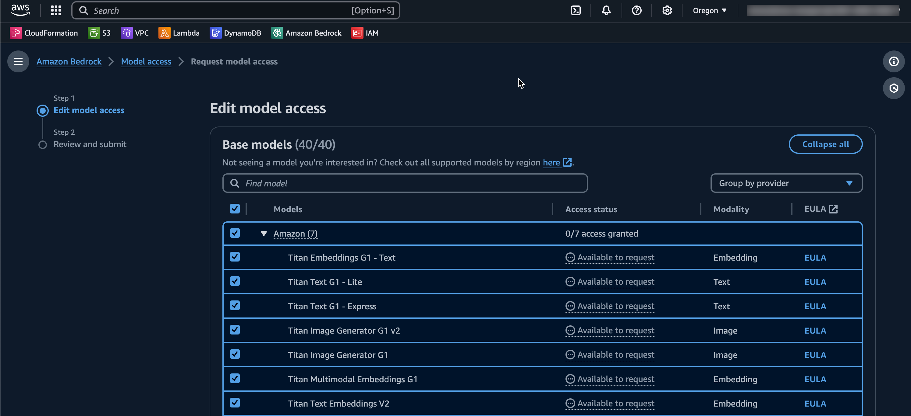
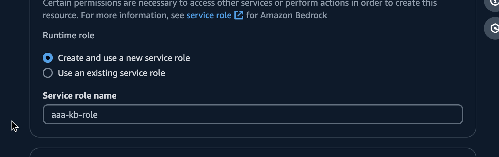
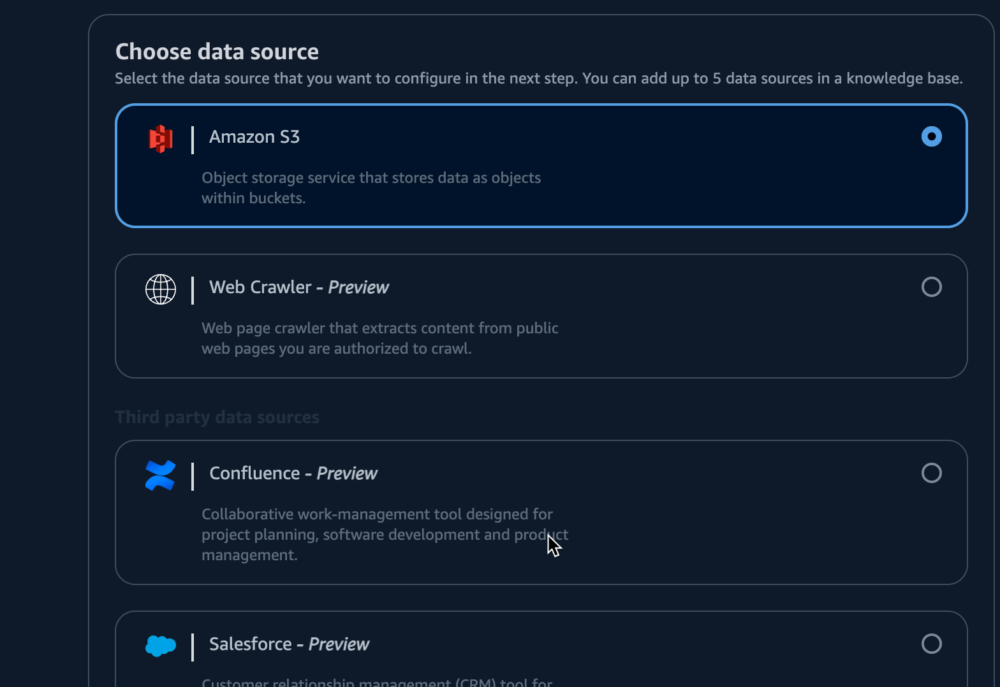
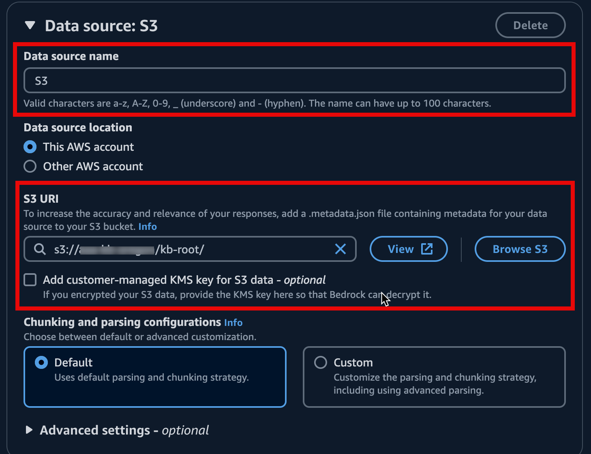
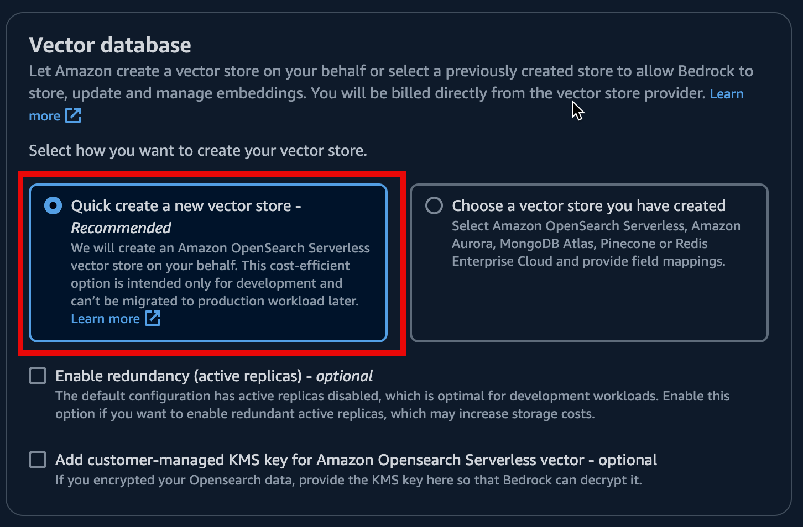

# Prerequisites

`AAA` 설치를 위해서 사전 준비되어야 할 것.
- Amazon Connect와 Contact Lens 설정
- Knowledge Base와 통화 요약을 위한 S3 Bucket
- Bedrock FM모델 Access 권한 획득

## Amazon Connect & Contact Lens

`Amazon Connect`의 설치는 AWS Workshop Studio를 통해서 진행합니다.

- [Amazon Connect Contact Lens Workshop](https://catalog.us-east-1.prod.workshops.aws/workshops/0d424f45-a4df-4818-ab35-5cf4fad6a66a/ko-KR)

상담 요약을 사용 하려면 [Contact Lens를 필수로 활성화](https://catalog.us-east-1.prod.workshops.aws/workshops/0d424f45-a4df-4818-ab35-5cf4fad6a66a/ko-KR/3contact-lens-instructions) 해야 합니다.

`Amazon Connect`를 생성하고 아래 명령어를 통해 `Connect Id`를 다음을 위해서 저장합니다.

```shell
#aws connect list-instances \
#  --query 'InstanceSummaryList[?InstanceAlias==`<CONNECT-ALIAS>`].Id | [0]'
$ aws connect list-instances \
  --query 'InstanceSummaryList[?InstanceAlias==`test-callcenter`].Id | [0]'
"9967ee71-69b7-481b-9618-XXXXXXXX"
```

> `CONTACT-ALIAS`는 자신의 Connect Alias로 변경

## Obtain access permission of Foundation Models

Bedrock을 이용하기 위해서 제공되는 `Foundation Model(FM)`의 Access 권한을 획득 해야 합니다.

- [Bedrock AWS Console](https://us-west-2.console.aws.amazon.com/bedrock/home?region=us-west-2#/modelaccess)로 이동
- `Enable all models` 또는 `Enable specific models`를 선택
- 사용을 원하는 `FM Model`을 선택한뒤 `Submit`으로 활성화 합니다. 아래 모델은 필수로 선택
    - Titan Text Embeddings V2 (RAG에서 사용)
    - Claude 3 Haiku (채팅 기본 모델)
    - Claude 3.5 Sonnet (상담 요약 기본 모델)




## Set up Bedrock Knowledge Base with OpenSearch Serverless for RAG

RAG를 위해 Bedrock Knowledge Base & OpenSearch Serverless 설치 합니다.

> `Bedrock` `Knowledge Base` Oregon Region(us-west-2)을 기준으로 작성됩니다.

[Knowledge Base Console](https://us-west-2.console.aws.amazon.com/bedrock/home?region=us-west-2#/knowledge-bases)로 이동하여 새로운 Knowledge base를 생성합니다.


IAM permission은 새로운 Role 생성을 선택하고,



`Data source option`에서 `Amazon S3`를 선택, 그리고 `Next`



Data source 상세 입력에서 `S3 URI`에 `RAG`를 위한 소스 컨텐츠가 들어갈 S3 Bcuket과 Path를 선택합니다.



> S3에 업로드된 File은 Knowledge Base에서 RAG의 데이터 소스로 변환합니다.
> 지원되는 파일 Format은 'txt, md, html, doc/docx, cvs, xls/xlsx, pdf' 입니다.
> 지원 가능한 파일 포멧과 제한사항은 [이곳](https://docs.aws.amazon.com/bedrock/latest/userguide/knowledge-base-ds.html)에서 확인 가능합니다.

Embedding을 위한 FM Model을 선택하는 화면입니다.


적절한 Embedding Model을 선택합니다. 여기선 `Titan Text Embeddings V2` 모델을 선택합니다.

> `Titan Embeddings V2`가 더 최신 버전이지만, 호환성성이나 선호하는 모델에 따라 적절한 모델을 선택 합니다.

`Vector Store`를 설정합니다. 여기선 새로운 Vector Store를 생성을 선택하고 `Next`

> 새로운 Vector Store 는 `Amazon OpenSerch Serverless`(AOSS)를 사용합니다. 아래 Vector Store 중 기존에 사용하던 것이 있다면, 설정해서 사용이 가능합니다.
>
> - Amazon OpenSarch Serverless,
> - Amazon Aurora
> - MongoDB Atlas
> - Pinecone
> - Redis Enterprise Cloud



마지막으로 생성하기를 눌러 `Knowledge Base`를 생성합니다.

> `OpenSearch Serverless`의 `Collection` 생성은 많은 시간이 소요됩니다.
> 

이제 다시 Knowledge Base Console에서 생성된 내용을 확인합니다.


> `Knowledge base ID`를 나중에 사용할 수 있도록 복사해 둡니다.

하단 `Data source`에 등록한 `S3`가 정상적임을 확인할수 있습니다.


## Synchronize Data source

> 설정한 `Data source`인 `S3`에 파일이 갱신되어도 자동으로 반영되지 않습니다.
> 변경된 S3파일을 `Knowledge Base`에 반영하려면 `Sync`를 클릭해서 반영해 주어야 합니다.


