# Installation

`AAA` 설치를 위해서는 3단계의 설치가 필요합니다.

- Back-end를 위한 Lambda Stack 설치 (`Lambda`, `API Gateway`, `DynamoDB`, `SSM`)
- Front-end를 위한 Lambda Stack 설치 (`S3`, `CloudFront`)
- Front-end 코드 배포
- Amazon Connect에 3P App 활성화

## Install Lambda Stack

`CloudFormation`으로 배포를 위한 패키징 파일을 생성합니다.

- CNF-S3-BUCKET: 배포 파일들이 업로드 될 S3 Bucket
- CNF-S3-PREFIX: 배포 파일들이 업로드 될 S3 Path Prefix

```shell
$ aws cloudformation package \
  --template-file lambdas/template.yaml \
  --s3-bucket <CFN-S3-BUCKET> \
  --s3-prefix <CFN-S3-PREFIX> \
  --output-template-file lambdas/template-out.yaml
```

**Example**

```shell
$ aws cloudformation package \
  --template-file lambdas/template.yaml \
  --s3-bucket cfn-deploy-bucket \
  --s3-prefix lambdas \
  --output-template-file lambdas/template-out.yaml
```

**패키징 처리된 파일 배포**

- STACK-NAME: CloudFormation Stack

```shell
$ aws cloudformation deploy \
  --capabilities CAPABILITY_IAM CAPABILITY_AUTO_EXPAND CAPABILITY_NAMED_IAM \
  --template-file lambdas/template-out.yaml \
  --stack-name <STACK-NAME> \
  --parameter-overrides <PARAMETER-KEY-VALUE> <PARAMETER-KEY-VALUE> ...
```

Parameter 정보

- **ConnectId**: Amazon Connect Instance Id
    - Required
    - Example: abcde12-def3-ghi4-jkl5-mnopqrs67890
- **SummaryBucketName**: 상담 요약 S3 Bucket, Knowledge Base의 Data source의 Bucket과 동일
    - Required
- **SummaryBucketPrefix**: 상담 요약 S3 Prefix, Knowledge Base의 Data source의 Prefix와 동일하거나 하위어야 함.
    - Required
- **LambdaSGs**: Lambda 함수에 설정할 Security Group ID, 두개 이상일 때는 ','로 구분
    - Required
    - Example: sg-abcdefghij1234
- **LambdaSubnets**: Lambda 함수가 동작할 Subnet ID. 두개 이상일 때는 ','로 구분
    - Required
    - Example: subnet-abcdefghik12345,subnet-abcdefghik12346
- **BedrockKnowledgeBaseId**: Knowledge Base Id
    - Required
    - Exampel: ABCDEF1234
- **BedrockRegion**: Bedrock Region
    - default: us-west-2
- **BedrockModelId**: Chatbot을 위한 Bedrock Model Id
    - default: anthropic.claude-3-haiku-20240307-v1:0
- **BedrockModelIdSummary**: 상담 요약을 위한 Bedrock Modle Id
    - default: anthropic.claude-3-5-sonnet-20240620-v1:0
- **SemanticCacheEnable**:
- **SemanticCacheEmbeddingModelId**:
- **SemanticCacheVectorDBEndpoint**:

**Example**

```shell
$ aws cloudformation deploy \
  --capabilities CAPABILITY_IAM CAPABILITY_AUTO_EXPAND CAPABILITY_NAMED_IAM \
  --template-file lambdas/template-out.yaml \
  --stack-name aaa-lambdas \
  --parameter-overrides \
  "ConnectId=9967ee71-69b7-481b-9618-*********" \
  "SummaryBucketName=aaa-kb-oregon" \
  "SummaryBucketPrefix=kb-root/contact-summary" \
  "BedrockKnowledgeBaseId=**********" \
  "LambdaSGs=sg-**************" \
  "LambdaSubnets=subnet-************,subnet-************" 
```

> **Important** - 생성된 Resource 중, `Api Gateway Endpoint`는 이후 사용을 위해서 확인해 둡니다.
```shell
$ aws cloudformation describe-stacks \
  --stack-name aaa-lambdas \
  --query 'Stacks[0].Outputs[?OutputKey==`ApiGatewayEndpoint`].OutputValue[] | [0]'
"https://***********.execute-api.ap-northeast-2.amazonaws.com/prod"
```

> Example 결과는 '*'로 마스킹 되어 있습니다.

## Install Front-end stack

`CloudFormation`으로 Front-end를 위한 Stack을 배포합니다. UI영역은 하나의 파일로 구성되어 있어, Packaging이 필요 없어 바로 배포합니다.

- CNF-S3-BUCKET: 배포 파일들이 업로드 될 S3 Bucket
- CNF-S3-PREFIX: 배포 파일들이 업로드 될 S3 Path Prefix
- STACK-NAME: CloudFormation Stack

```shell
$ aws cloudformation deploy \
  --template-file ui/template.yaml \
  --stack-name <STACK-NAME>
```

**Example**

```shell
$ aws cloudformation deploy \
  --template-file ui/template.yaml \
  --stack-name aaa-ui
```

생성된 리소스 들을 확인 합니다. 두 값 모두 추후 사용됩니다.

```shell
$ aws cloudformation describe-stacks \
  --stack-name aaa-ui \
  --query 'Stacks[0].Outputs'
[
    {
        "OutputKey": "Bucket",
        "OutputValue": "aaa-ui-81c4d0c0-83ea-11ef-8a4c-***********",
        "Description": "Bucket Name"
    },
    {
        "OutputKey": "DistributionDomainName",
        "OutputValue": "**************.cloudfront.net",
        "Description": "Domain name of the CloudFront distribution"
    }
] 
```

> **Important** - Example 결과는 '*'로 마스킹 되어 있습니다.

## Deploy UI

UI 서비스를 위한 Resource(S3)에 Front-end 파일들을 배포 합니다.
여기선 간단히 배포에 대해서만 설명합니다.

좀더 상세한 설명을 [UI README](ui/README.md)를 참고

우선 배포하기 전에, `Lambda Stack`에서 생성한 `Api Geteway Endpoint`를 설정 파일을 수정하여 반영 합니다.

- 설정 파일 위치: `ui/src/Configure.tsx`

```shell
$ cd ui
$ cat src/Configure.tsx
// Target URL for  the API Gateway
export const BACKEND_API_BASE_URL = '<APIGW-INVOKE-URL>';
```

NPM 패키지 설치와 Webpack을 이용해서 UI코드를 패키징 합니다.

```shell
$ npm install
.....
$ npx webpack # Same with $ npm run build
.....
```

Webpack 패키징이 끝나면 `dist` 폴더에 배포 가능한 파일들이 생성됩니다.

```shell
$ ls -la dist
-rw-r--r--  1 ****** ***** 602218  8 26 18:00 bundle.js
-rw-r--r--  1 ****** *****   1652  8 25 19:07 bundle.js.LICENSE.txt
-rw-r--r--  1 ****** *****    246  8 21 15:12 index.html
```

생성된 파일을 UI Stack에서 생성한 S3 위치에 배포합니다.
UI Stack에서 생성한 S3 Bucket Name으로 변경하여 실행합니다.
```shell
#$ aws s3 sync ./dist/ s3://<YOUR-S3-BUCKET-NAME> --delete
$ aws s3 sync ./dist/ s3://aaa-ui-81c4d0c0-83ea-11ef-8a4c-*********** --delete
```
이제 UI 준비는 끝났습니다.

## Setup 3P App in Amazon Connect
`Aamzon Connect`에 `3P App`을 활성화 하기 위해서는 다음과 같은 작업이 필요합니다.
- `Aamazon Connect`에 3P App 등록하기 (`AWS Console`)
- 고객센터 설정에서 프로파일별 3P App 권한 부여
- `Agent Workspace`에서 최종 확인

**AWS Connect에 3P App 등록하기 (AWS Console)**
먼저 [`Connect Console`](https://ap-northeast-2.console.aws.amazon.com/connect/v2/app/instances?region=ap-northeast-2)에 접속하여 `Third-party Application` 설정으로 들어갑니다.

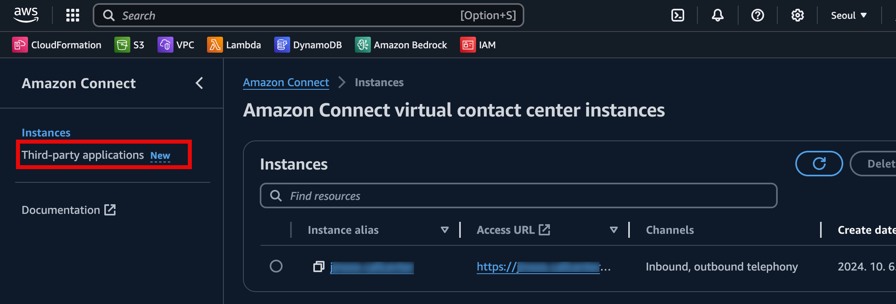

새로운 App Application 등록 절차를 시작합니다.

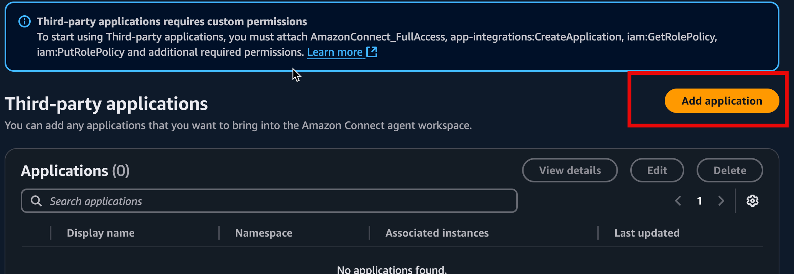

`Display name`과 `Namespace`를 원하는 값으로 설정하고,
`Access URL`에 `UI Stack`에서 생성한 `CloudFront Endpoint`를 넣습니다.
> **Important** 이때 `/index.html`을 포함하여야 합니다.
- Example: https://***********.cloudfront.net/index.html

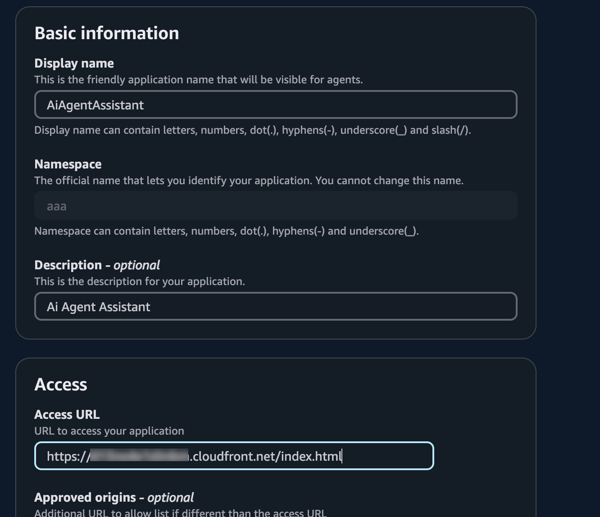

하단에 Instance association에 이미 만들어져 있는 Connect Instance를 선택하고, `Add application` 합니다.

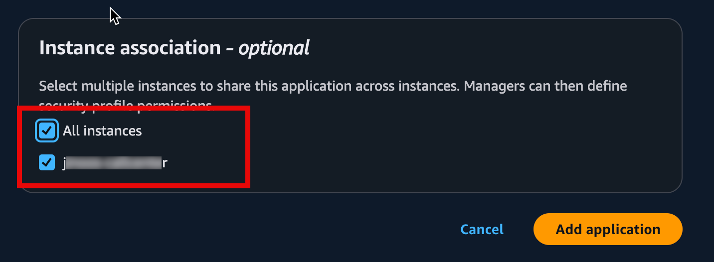

`Access information`의 링크를 통해 고객센터 관리 Console로 접속합니다.
Connect는 멀티테넌트로 구성되어, 고객센터 권한별 별도의 관리환경을 제공합니다.
링크를 통해 해당 고객센터 관리환경으로 접속합니다.

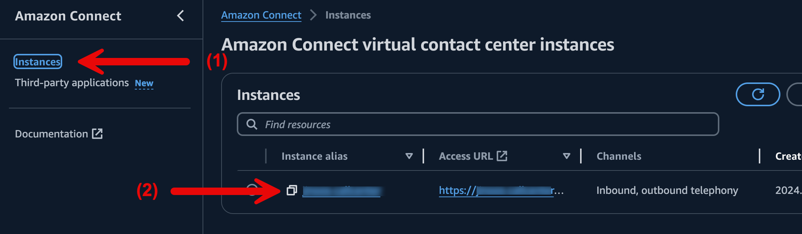
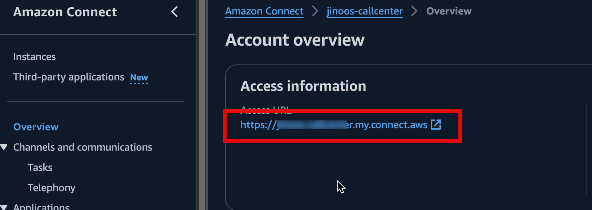

고객센터 관리 환경에 접속할 때, ID/PW 입력과 같은 인증 절차가 있을 수 있습니다.
Instance 생성 초기에 설정한 관리자 ID와 PW를 활용합니다.

**고객센터 설정에서 프로파일별 3P App 권한 부여**

Connect의 계정은 하나 이상의 Profile에 속할수 있으며, Profile 별로 기능과 권한을 관리합니다.

왼쪽 메뉴의 `User` > `Security profiles`로 권한 관리 메뉴로 진입 힙니다.

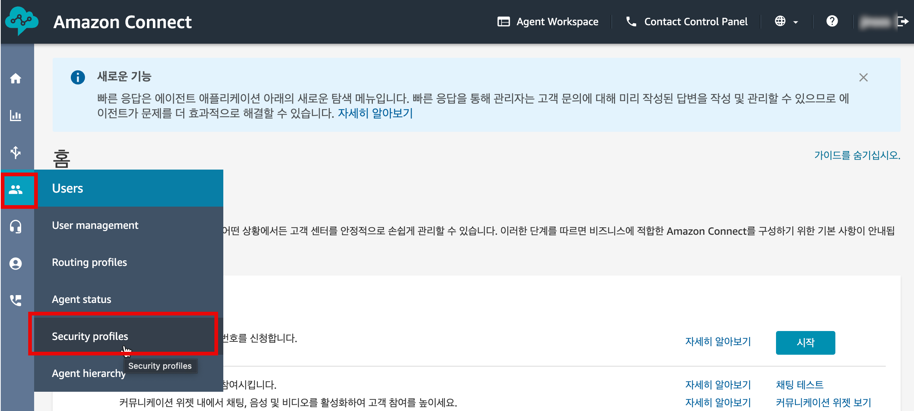

등록된 Admin 프로파일로 진입하여, 하단 `에이전트 애플리케이션`의 폴더를 열면 등록한 `3P App`을 볼수 있으며,
`AiAgentAssistant`의 액세스 권한을 설정하고 저장합니다.

> 원하는 Profile 모두 위 등록 작업을 진행합니다.

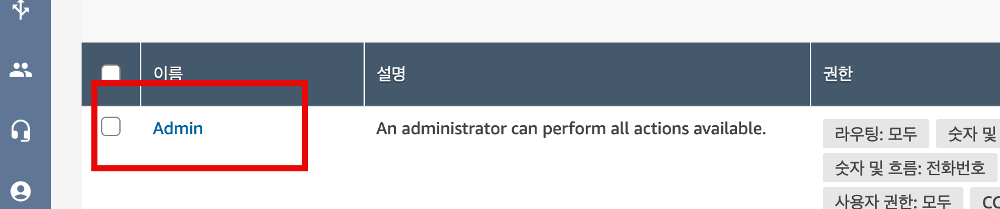
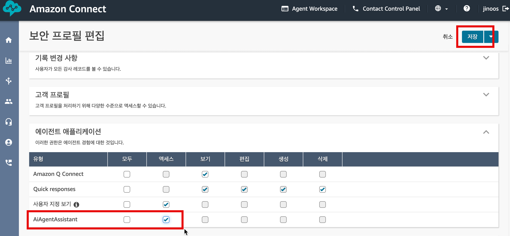

**`Agent Workspace`에서 최종 확인**

이제 상담사가 사용하는 Agent Workspac는 상단의 링크를 통해 진입이 가능 합니다.

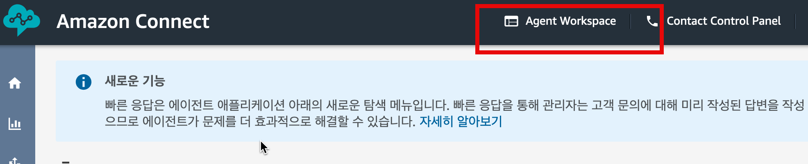

Agent Workspace 화면에서 3P App 활성화는 상단 오른편의 Drop Down 메뉴에서 가능 합니다.

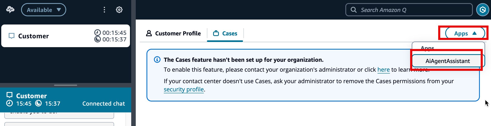

Agent Workspace에서 활성화된 AAA의 최종 화면입니다. 상담중에 고객의


