# Ai agent assistant for Amazon Connect with Bedrock

## Ai Agent Assistant

`Ai Agent Assistant(AAA)`는 [Amazon Connect](https://aws.amazon.com/ko/connect/)의
[Agent Workspace](https://aws.amazon.com/ko/connect/agent-workspace/)에서
동작하는 [3rd-party Application](https://docs.aws.amazon.com/agentworkspace/latest/devguide/getting-started.html)입니다.

상담원이 고객과 삼당 중에 LLM에 질의하여, 도움이 되는 정보를 습득하고, 이를통해 효과적으로 고객을 응대하기 위한 도구입니다.

`Ai Agent Assistant`에는 다음과 같은 기능이 있습니다.

- 채팅 기반의 UI
- RAG 기반의 LLM 응답
- 삼당(통화) 중 LLM 질의/응답 기록 확인
- 상담(통화) 내역 요약 및 RAG 피드백

## Architecture

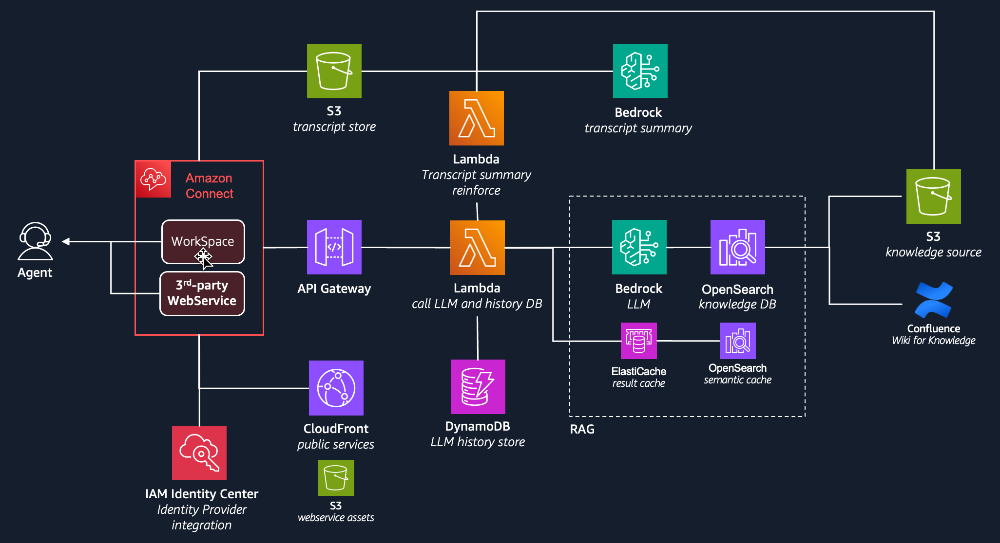

`Ai Agent Assistant(AAA)`가 `Amazon Connect`의 `3rd-party Application`으로 등록되면,
상담사 `UI Interface`인 `Agent Workspace`와 하나의 UI로 동작합니다.
`AAA`의 Front-end는 [Amazon S3](https://aws.amazon.com/ko/s3/)와
[Amazon CloudFront](https://aws.amazon.com/ko/cloudfront/)의 조합으로 WebService를 구성합니다.

Front-end Action을 위한 Back-end는 [AWS Lambda](https://aws.amazon.com/ko/lambda/)(Python)로 구성되어 있으며,
상담사의 질의를 [Amazon Bedrock](https://aws.amazon.com/ko/bedrock/)을 통해 적절한 Content로 제공되며,
회사의 내부자료를 바탕으로 한 응답 생성을 위해서 [Bedrock Knowledge Base](https://aws.amazon.com/ko/bedrock/knowledge-bases/)으로 RAG가 구현되어 있습니다.

`Amazon Connect`의 상담(통화) 내역은 `S3`에 저장 됩니다. 저장된 상담 내용을 `Amazon Bedrock`을 통해 요약(Call Summarization)하고,
이것을 다시 `RAG`의 자료로 전달하는 흐름(Flow)이 구성되어 있어, LLM 정보를 강화할 수 있습니다.

## Prerequisites

`AAA` 설치를 위해서 사전 준비되어야 할 것.

- Amazon Connect와 Contact Lens 설정
- Knowledge Base와 통화 요약을 위한 S3 Bucket
- Bedrock FM모델 Access 권한 획득

### Amazon Connect & Contact Lens

`Amazon Connect`의 설치는 AWS Workshop Studio를 통해서 진행합니다.

- [Amazon Connect Contact Lens Workshop](https://catalog.us-east-1.prod.workshops.aws/workshops/0d424f45-a4df-4818-ab35-5cf4fad6a66a/ko-KR)

상담 요약을 사용 하려면 [Contact Lens를 필수로 활성화](https://catalog.us-east-1.prod.workshops.aws/workshops/0d424f45-a4df-4818-ab35-5cf4fad6a66a/ko-KR/3contact-lens-instructions) 해야 합니다.

`Amazon Connect`를 생성하고 아래 명령어를 통해 `Connect Id`를 다음을 위해서 저장합니다.

```shell
#aws connect list-instances \
#  --query 'InstanceSummaryList[?InstanceAlias==`<CONNECT-ALIAS>`].Id | [0]'
$ aws connect list-instances \
  --query 'InstanceSummaryList[?InstanceAlias==`test-callcenter`].Id | [0]'
"9967ee71-69b7-481b-9618-XXXXXXXX"
```

> `CONTACT-ALIAS`는 자신의 Connect Alias로 변경

### Get FM Access Grant

Bedrock을 이용하기 위해서 제공되는 `Foundation Model(FM)`의 Access 권한을 획득 해야 합니다.

- [Bedrock AWS Console](https://us-west-2.console.aws.amazon.com/bedrock/home?region=us-west-2#/modelaccess)로 이동
- `Enable all models` 또는 `Enable specific models`를 선택
- 사용을 원하는 `FM Model`을 선택한뒤 `Submit`으로 활성화 합니다. 아래 모델은 필수로 선택
  - Titan Text Embeddings V2 (RAG에서 사용)
  - Claude 3 Haiku (채팅 기본 모델)
  - Claude 3.5 Sonnet (상담 요약 기본 모델)

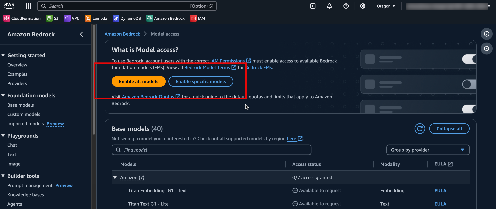
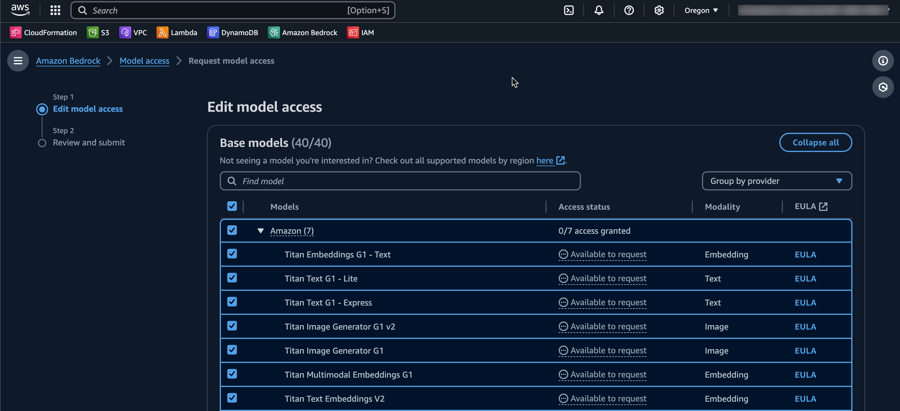

### Set up Bedrock Knowledge Base with OpenSearch Serverless for RAG

RAG를 위해 Bedrock Knowledge Base & OpenSearch Serverless 설치 합니다.

> `Bedrock` `Knowledge Base` Oregon Region(us-west-2)을 기준으로 작성됩니다.

[Knowledge Base Console](https://us-west-2.console.aws.amazon.com/bedrock/home?region=us-west-2#/knowledge-bases)로 이동하여 새로운 Knowledge base를 생성합니다.

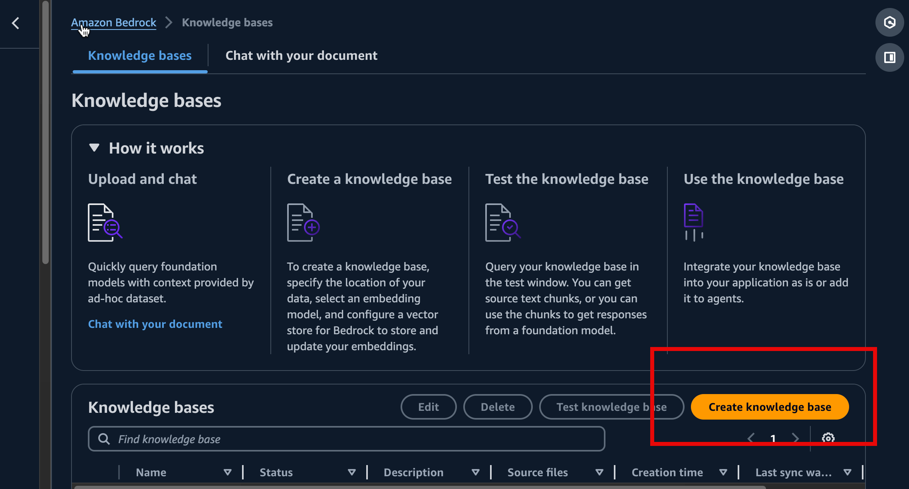

IAM permission은 새로운 Role 생성을 선택하고,

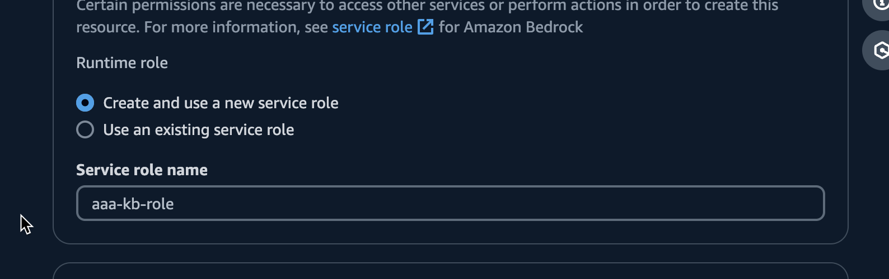

`Data source option`에서 `Amazon S3`를 선택, 그리고 `Next`

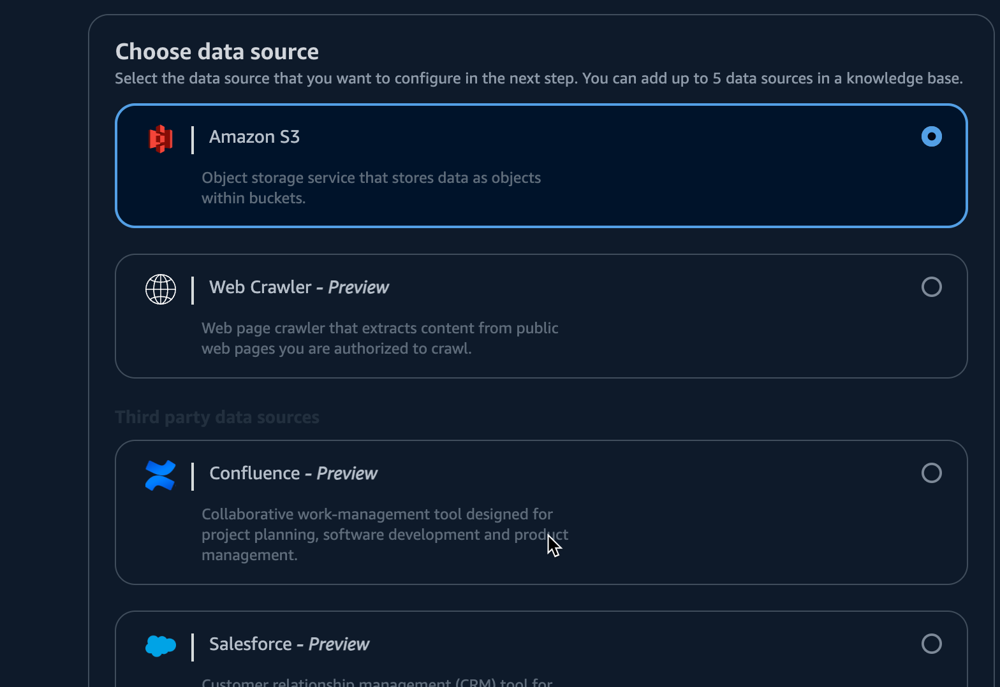

Data source 상세 입력에서 `S3 URI`에 `RAG`를 위한 소스 컨텐츠가 들어갈 S3 Bcuket과 Path를 선택합니다.

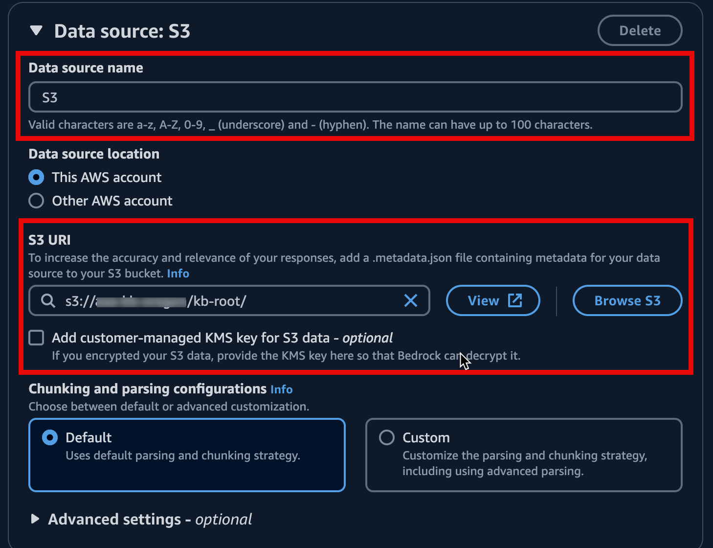

> S3에 업로드된 File은 Knowledge Base에서 RAG의 데이터 소스로 변환합니다.
> 지원되는 파일 Format은 'txt, md, html, doc/docx, cvs, xls/xlsx, pdf' 입니다.
> 지원 가능한 파일 포멧과 제한사항은 [이곳](https://docs.aws.amazon.com/bedrock/latest/userguide/knowledge-base-ds.html)에서 확인 가능합니다.

Embedding을 위한 FM Model을 선택하는 화면입니다.

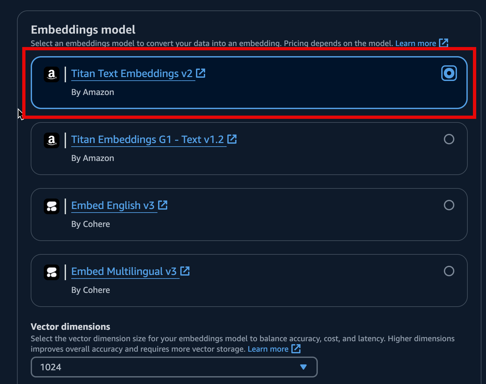

적절한 Embedding Model을 선택합니다. 여기선 `Titan Text Embeddings V2` 모델을 선택합니다.

> `Titan Embeddings V2`가 더 최신 버전이지만, 호환성성이나 선호하는 모델에 따라 적절한 모델을 선택 합니다.

`Vector Store`를 설정합니다. 여기선 새로운 Vector Store를 생성을 선택하고 `Next`

> 새로운 Vector Store 는 `Amazon OpenSerch Serverless`(AOSS)를 사용합니다. 아래 Vector Store 중 기존에 사용하던 것이 있다면, 설정해서 사용이 가능합니다.
>
> - Amazon OpenSarch Serverless,
> - Amazon Aurora
> - MongoDB Atlas
> - Pinecone
> - Redis Enterprise Cloud

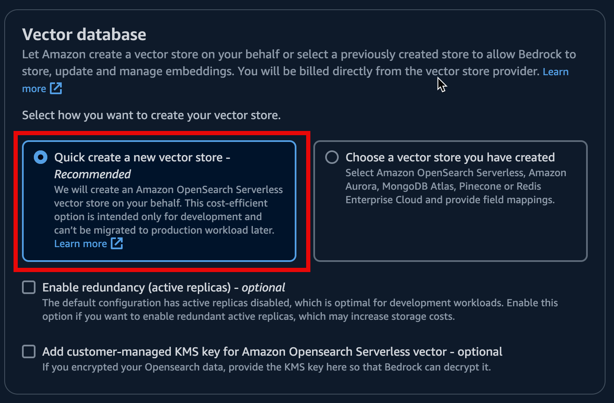

마지막으로 생성하기를 눌러 `Knowledge Base`를 생성합니다.

> `OpenSearch Serverless`의 `Collection` 생성은 많은 시간이 소요됩니다.
> 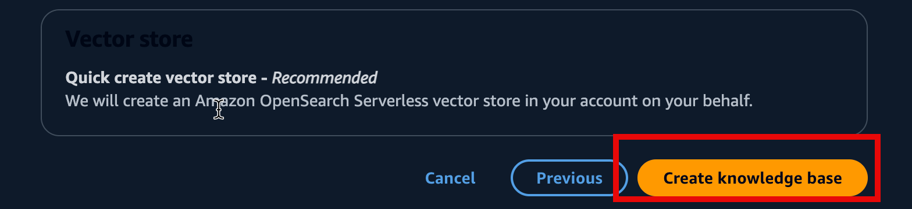

이제 다시 Knowledge Base Console에서 생성된 내용을 확인합니다.

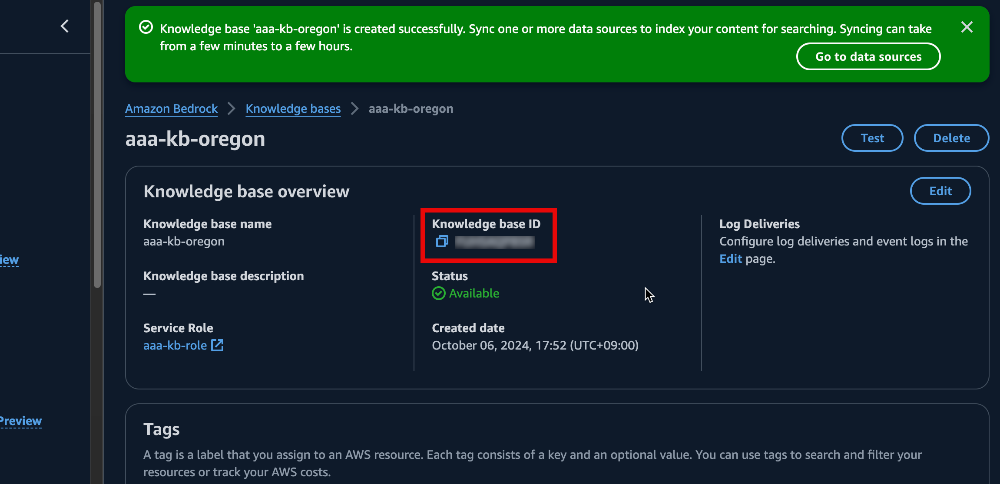

> `Knowledge base ID`를 나중에 사용할 수 있도록 복사해 둡니다.

하단 `Data source`에 등록한 `S3`가 정상적임을 확인할수 있습니다.

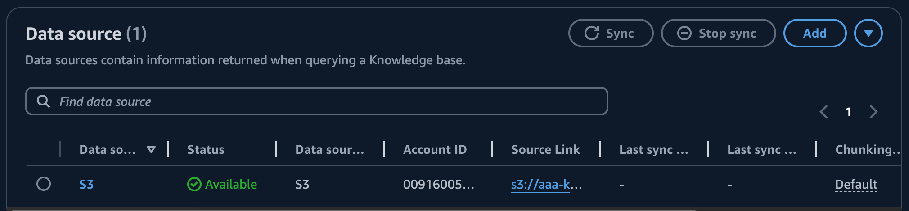

### Synchronize Data source

> 설정한 `Data source`인 `S3`에 파일이 갱신되어도 자동으로 반영되지 않습니다.
> 변경된 S3파일을 `Knowledge Base`에 반영하려면 `Sync`를 클릭해서 반영해 주어야 합니다.

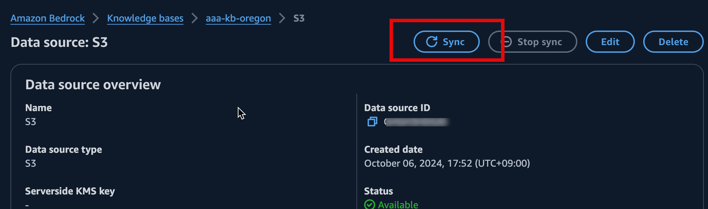

## Installation

`AAA` 설치를 위해서는 3단계의 설치가 필요합니다.

- Back-end를 위한 Lambda Stack 설치 (`Lambda`, `API Gateway`, `DynamoDB`, `SSM`)
- Front-end를 위한 Lambda Stack 설치 (`S3`, `CloudFront`)
- Front-end 코드 배포

### Install Lambda Stack

`CloudFormation`으로 배포를 위한 패키징 파일을 생성합니다.

- CNF-S3-BUCKET: 배포 파일들이 업로드 될 S3 Bucket
- CNF-S3-PREFIX: 배포 파일들이 업로드 될 S3 Path Prefix

```shell
$ aws cloudformation package \
  --template-file lambdas/template.yaml \
  --s3-bucket <CFN-S3-BUCKET> \
  --s3-prefix <CFN-S3-PREFIX> \
  --output-template-file lambdas/template-out.yaml
```

**Example**

```shell
$ aws cloudformation package \
  --template-file lambdas/template.yaml \
  --s3-bucket cfn-deploy-bucket \
  --s3-prefix lambdas \
  --output-template-file lambdas/template-out.yaml
```

**패키징 처리된 파일 배포**

- STACK-NAME: CloudFormation Stack

```shell
$ aws cloudformation deploy \
  --capabilities CAPABILITY_IAM CAPABILITY_AUTO_EXPAND CAPABILITY_NAMED_IAM \
  --template-file lambdas/template-out.yaml \
  --stack-name <STACK-NAME> \
  --parameter-overrides <PARAMETER-KEY-VALUE> <PARAMETER-KEY-VALUE> ...
```

Prameter 정보

- **ConnectId**: Amazon Connect Instance Id
  - Required
  - Example: abcde12-def3-ghi4-jkl5-mnopqrs67890
- **SummaryBucketName**: 상담 요약 S3 Bucket, Knowledge Base의 Data source의 Bucket과 동일
  - Required
- **SummaryBucketPrefix**: 상담 요약 S3 Prefix, Knowledge Base의 Data source의 Prefix와 동일하거나 하위어야 함.
  - Required
- **LambdaSGs**: Lambda 함수에 설정할 Security Group ID, 두개 이상일 때는 ','로 구분
  - Required
  - Example: sg-abcdefghij1234
- **LambdaSubnets**: Lambda 함수가 동작할 Subnet ID. 두개 이상일 때는 ','로 구분
  - Required
  - Example: subnet-abcdefghik12345,subnet-abcdefghik12346
- **BedrockKnowledgeBaseId**: Knowledge Base Id
  - Required
  - Exampel: ABCDEF1234
- **BedrockRegion**: Bedrock Region
  - default: us-west-2
- **BedrockModelId**: Chatbot을 위한 Bedrock Model Id
  - default: anthropic.claude-3-haiku-20240307-v1:0
- **BedrockModelIdSummary**: 상담 요약을 위한 Bedrock Modle Id
  - default: anthropic.claude-3-5-sonnet-20240620-v1:0
- **SemanticCacheEnable**:
- **SemanticCacheEmbeddingModelId**:
- **SemanticCacheVectorDBEndpoint**:

**Example**

```shell
$ aws cloudformation deploy \
  --capabilities CAPABILITY_IAM CAPABILITY_AUTO_EXPAND CAPABILITY_NAMED_IAM \
  --template-file lambdas/template-out.yaml \
  --stack-name aaa-lambdas \
  --parameter-overrides \
  "ConnectId=9967ee71-69b7-481b-9618-*********" \
  "SummaryBucketName=aaa-kb-oregon" \
  "SummaryBucketPrefix=kb-root/contact-summary" \
  "BedrockKnowledgeBaseId=**********" \
  "LambdaSGs=sg-**************" \
  "LambdaSubnets=subnet-************,subnet-************" 
```

> **Important** - 생성된 Resource 중, `Api Gateway Endpoint`는 이후 사용을 위해서 확인해 둡니다.
```shell
$ aws cloudformation describe-stacks \
  --stack-name aaa-lambdas \
  --query 'Stacks[0].Outputs[?OutputKey==`ApiGatewayEndpoint`].OutputValue[] | [0]'
"https://***********.execute-api.ap-northeast-2.amazonaws.com/prod"
```

> Example 결과는 '*'로 마스킹 되어 있습니다.

### Install Front-end stack

`CloudFormation`으로 Front-end를 위한 Stack을 배포합니다. UI영역은 하나의 파일로 구성되어 있어, Packaging이 필요 없어 바로 배포합니다.

- CNF-S3-BUCKET: 배포 파일들이 업로드 될 S3 Bucket
- CNF-S3-PREFIX: 배포 파일들이 업로드 될 S3 Path Prefix
- STACK-NAME: CloudFormation Stack

```shell
$ aws cloudformation deploy \
  --template-file ui/template.yaml \
  --stack-name <STACK-NAME>
```

**Example**

```shell
$ aws cloudformation deploy \
  --template-file ui/template.yaml \
  --stack-name aaa-ui
```

생성된 리소스 들을 확인 합니다. 두 값 모두 추후 사용됩니다.

```shell
$ aws cloudformation describe-stacks \
  --stack-name aaa-ui \
  --query 'Stacks[0].Outputs'
[
    {
        "OutputKey": "Bucket",
        "OutputValue": "aaa-ui-81c4d0c0-83ea-11ef-8a4c-***********",
        "Description": "Bucket Name"
    },
    {
        "OutputKey": "DistributionDomainName",
        "OutputValue": "**************.cloudfront.net",
        "Description": "Domain name of the CloudFront distribution"
    }
] 
```

> **Important** - Example 결과는 '*'로 마스킹 되어 있습니다.

### UI 배포하기

UI 서비스를 위한 Resource(S3)에 Front-end 파일들을 배포 합니다.
여기선 간단히 배포에 대해서만 설명합니다.

좀더 상세한 설명을 [UI README](ui/README.md)를 참고

우선 배포하기 전에, `Lambda Stack`에서 생성한 `Api Geteway Endpoint`를 설정 파일을 수정하여 반영 합니다.

- 설정 파일 위치: `ui/src/Configure.tsx`

```shell
$ cd ui
$ cat src/Configure.tsx
// Target URL for  the API Gateway
export const BACKEND_API_BASE_URL = '<APIGW-INVOKE-URL>';
```

NPM 패키지 설치와 Webpack을 이용해서 UI코드를 패키징 합니다.

```shell
$ npm install
.....
$ npx webpack # Same with $ npm run build
.....
```

Webpack 패키징이 끝나면 `dist` 폴더에 배포 가능한 파일들이 생성됩니다.

```shell
$ ls -la dist
-rw-r--r--  1 ****** ***** 602218  8 26 18:00 bundle.js
-rw-r--r--  1 ****** *****   1652  8 25 19:07 bundle.js.LICENSE.txt
-rw-r--r--  1 ****** *****    246  8 21 15:12 index.html
```

생성된 파일을 UI Stack에서 생성한 S3 위치에 배포합니다.
UI Stack에서 생성한 S3 Bucket Name으로 변경하여 실행합니다.
```shell
#$ aws s3 sync ./dist/ s3://<YOUR-S3-BUCKET-NAME> --delete
$ aws s3 sync ./dist/ s3://aaa-ui-81c4d0c0-83ea-11ef-8a4c-*********** --delete
```
이제 UI 준비는 끝났습니다. 

### Setup 3P App in Amazon Connect


###
