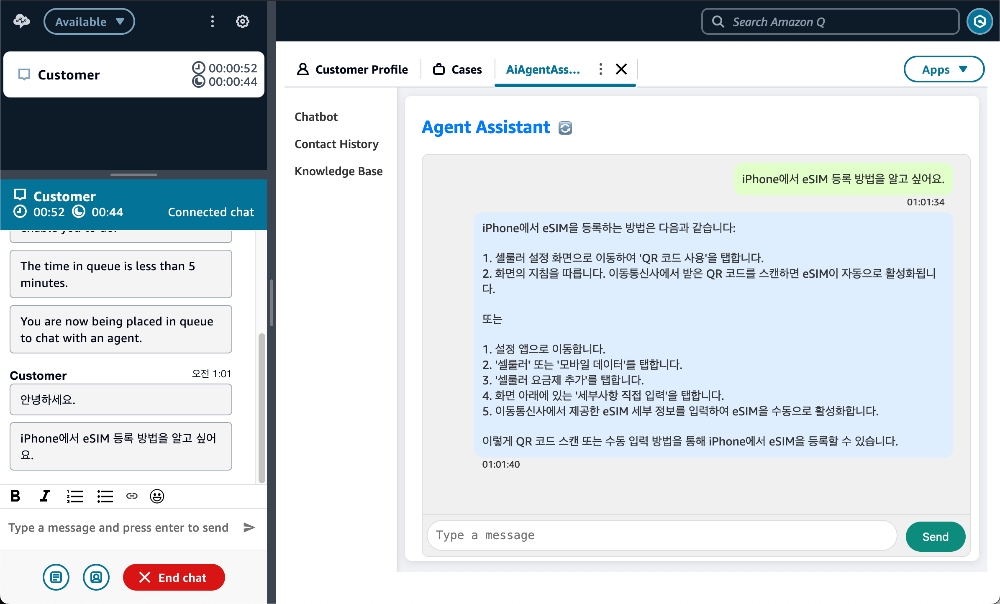

# Ai agent assistant for Amazon Connect(with Bedrock)

## Ai Agent Assistant

`Ai Agent Assistant(AAA)`는 [Amazon Connect](https://aws.amazon.com/ko/connect/)의
[Agent Workspace](https://aws.amazon.com/ko/connect/agent-workspace/)에서
동작하는 [3rd-party Application](https://docs.aws.amazon.com/agentworkspace/latest/devguide/getting-started.html)입니다.

상담원이 고객과 삼당 중에 LLM에 질의하여, 도움이 되는 정보를 습득하고, 이를통해 효과적으로 고객을 응대하기 위한 도구입니다.

`Ai Agent Assistant`에는 다음과 같은 기능이 있습니다.

- 채팅 기반의 UI
- RAG 기반의 LLM 응답
- 삼당(통화) 중 LLM 질의/응답 기록 확인
- 상담(통화) 내역 요약 및 RAG 피드백

## Architecture

`Ai Agent Assistant(AAA)`가 `Amazon Connect`의 `3rd-party Application`으로 등록되면,
상담사 `UI Interface`인 `Agent Workspace`와 하나의 UI로 동작합니다.
`AAA`의 Front-end는 [Amazon S3](https://aws.amazon.com/ko/s3/)와
[Amazon CloudFront](https://aws.amazon.com/ko/cloudfront/)의 조합으로 WebService를 구성합니다.

Front-end Action을 위한 Back-end는 [AWS Lambda](https://aws.amazon.com/ko/lambda/)(Python)로 구성되어 있으며,
상담사의 질의를 [Amazon Bedrock](https://aws.amazon.com/ko/bedrock/)을 통해 적절한 Content로 제공되며,
회사의 내부자료를 바탕으로 한 응답 생성을 위해서 [Bedrock Knowledge Base](https://aws.amazon.com/ko/bedrock/knowledge-bases/)으로 RAG가 구현되어 있습니다.

`Amazon Connect`의 상담(통화) 내역은 `S3`에 저장 됩니다. 저장된 상담 내용을 `Amazon Bedrock`을 통해 요약(Call Summarization)하고,
이것을 다시 `RAG`의 자료로 전달하는 흐름(Flow)이 구성되어 있어, LLM 정보를 강화할 수 있습니다.

## Prerequisites

`AAA` 설치를 위해서 사전 준비되어야 할 것.
- Amazon Connect와 Contact Lens 설정
- Knowledge Base와 통화 요약을 위한 S3 Bucket
- Bedrock FM모델 Access 권한 획득

**[README-Prerequisites](README-Prerequisites.md)**

## Installation

`AAA` 설치를 위해서는 아래의 단계가 필요합니다.

- Back-end를 위한 Lambda Stack 설치 (`Lambda`, `API Gateway`, `DynamoDB`, `SSM`)
- Front-end를 위한 Lambda Stack 설치 (`S3`, `CloudFront`)
- Front-end 코드 배포
- Amazon Connect에 3P App 활성화

**[README-Installation](README-installation.md)**

## Features - TBD

## License
This project is licensed under the MIT License. See the [LICENSE](LICENSE) file for the full license text.

MIT License

Copyright (c) 2024 Jinoos Lee