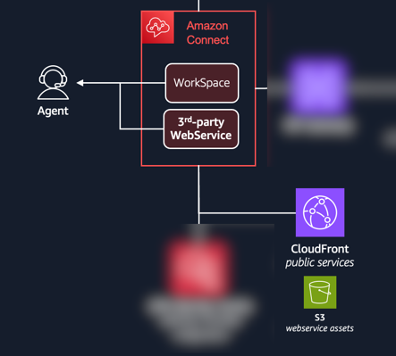
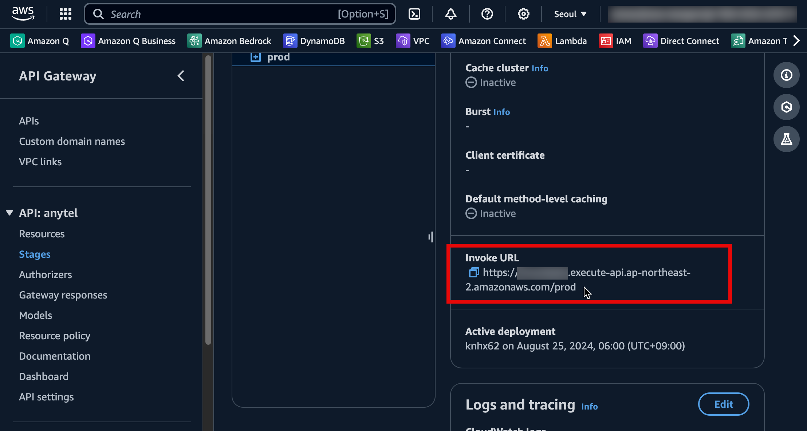

# UI for AI Agent Assistant

React와 TypeScript로 구성되된 SPA 프로젝트 입니다.
Frontend 개발에 지식이 부족하기에, 잘못된 정보가 있을 수 있습니다. :smiling_imp:

## 3P App for Amazon Connect


3P App은 `Amazon Connect`의 Workspace에 IFrame 형태로 Embed되어 통합된 UI를 제공하기 위한 기능입니다. 
3P App을 구성하기 위한 좀더 자세한 내용은 "[워크스페이스에 타사 애플리케이션 (3p 앱) 을 통합](https://docs.aws.amazon.com/ko_kr/connect/latest/adminguide/3p-apps.html)"을 참고하세요.

Workspace에서 3P App이 효과적으로 동작하기 위해서는 Workspace에서 데이터를 수신해야 합니다. 
예를들면 현재 Workspace의 Agent 정보나, 고객 응대 시작/종료와 같은 정보를 바탕으로 좀더 Interactive한 기능을 구현할수 있습니다. "[TypeScrpt 기반 Workspace 개발자 가이드](https://docs.aws.amazon.com/ko_kr/agentworkspace/latest/devguide/what-is-service.html)"를 참고하세요.

## Prerequisites
* 여기서 Node.js와 npm, Webpack에 대한 내용은 다루지 않겠습니다. [Node.js and npm](https://nodejs.org/) 참고
* S3 + CloudFront를 이용한 정적 Web Service 구성은 [여기](https://docs.aws.amazon.com/Route53/latest/DeveloperGuide/getting-started-cloudfront-overview.html)를 참고
* 필요한 패키지 설치
```shell
npm install react react-dom
npm install -D typescript @types/react @types/react-dom
npm install -D webpack webpack-cli webpack-dev-server
npm install -D ts-loader html-webpack-plugin
```

## Create S3 bucket & Cloudfront Distribution with Domain
> **Notice**: 프로젝트 Root에서 CF 패키지를 통해 이미 Stack 배포를 하였다면 아래는 생략 합니다.
 
3P App을 위한 S3 Bucket과 Public Service를 위한 CF Domain을 CloudFormation으로 생성합니다. 

### CFN Deploy
```shell
aws cloudformation deploy \
   --template-file ui.template \
   --stack-name <CNF-STACK-NAME> \
   --parameter-overrides "BucketName=<S3-BUCKET-NAME-UI-FILES>"
   
aws cloudformation deploy \
   --template-file ui.template \
   --stack-name aaa-ui \
   --parameter-overrides BucketName=aaa-ui
```
`CFN-STACK-NAME`과 `S3-BUCKET-NAME-UI-FILES`을 원하는 값으로 변경

## Configure Backend Endpoint
Lambda 호출을 위한 Backend API Gateway URL을 설정파일(```src/Configure.tsx```)에 업데이트 합니다.
```typescript
export const KB_API_BASE_URL = '<APIGW-INVOKE-URL>';
```

```APIGW-INVOKE-URL```은 ```AWS Console```>```API Gateway```>```APIs```>```Stage```에서 확인 가능 합니다.


## Setting up the project
Install the dependencies:
```sheel
npm install 
```

## Running the project
Local 환경에서 실행, 동작 테스트를 합니다.
아쉽게도 Local에서는 Workspace에서 Event를 수신할 수 없습니다.
```shell
npm start
```

## Building & deploying with Webpack
```shell
# build
npx webpack # Same with $ npm run build
```
AWS S3 Sync를 통한 dist 파일 배포
```shell
aws s3 sync ./dist/ s3://<YOUR-S3-BUCKET-NAME> --delete
```

## Additional Information
* The main entry point of the application is `src/index.tsx`.
* The webpack configuration is in `webpack.config.js`.
* TypeScript configuration can be found in `tsconfig.json`.

